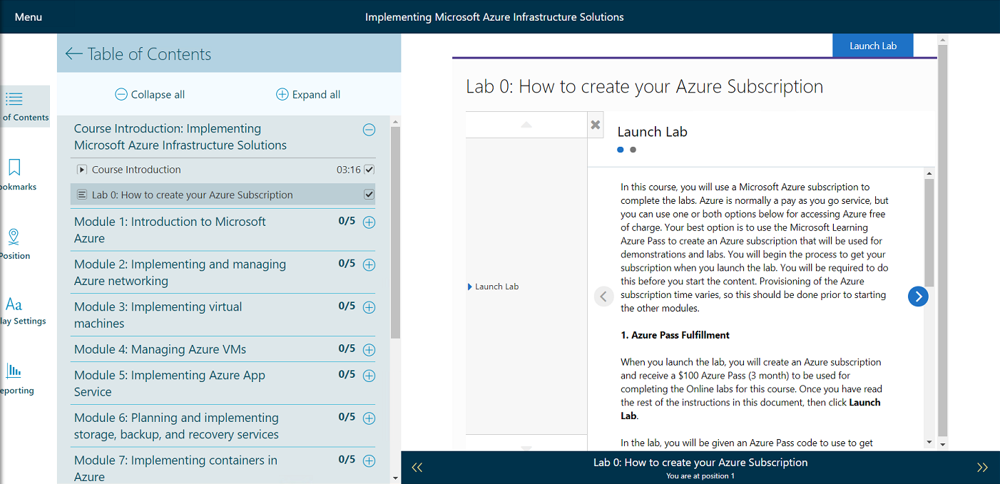
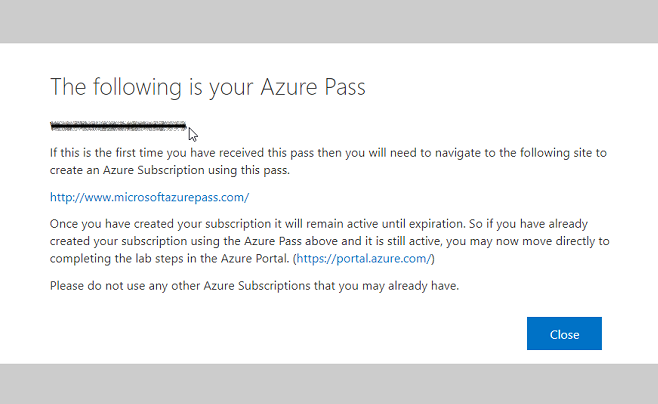
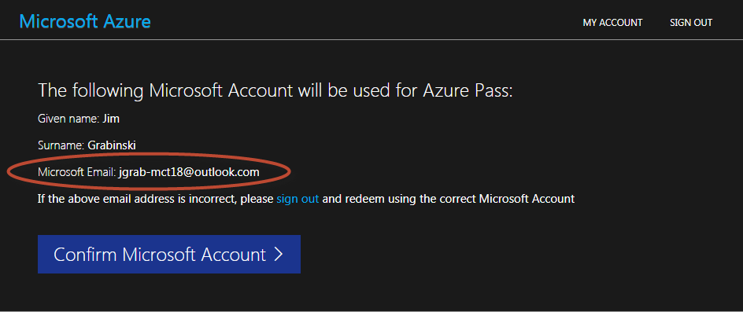
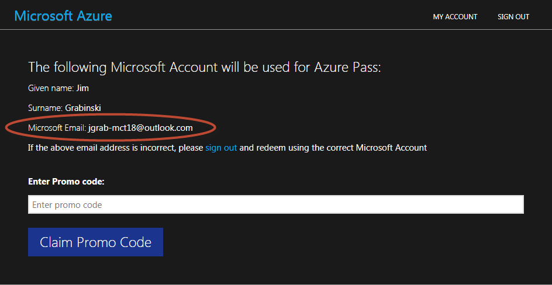

# Redeeming Azure Pass

1. Create a **[BRAND NEW Microsoft Account](https://signup.live.com)**, and click the option to get a new email address that will be used to redeem your Azure Pass. The scripts run in the labs may affect existing Azure services in your subscription so it's strongly recommended to use this new, separate Microsoft account and make it dedicated to training.

    **Note**: Creating the new account may require a text message verification.

1. Open the course from your bookshelf in **[Skillpipe](https://skillpipe.com)** in a web browser, and under **Course Introduction**, launch **Lab 0**.

    

1. When the course launches, your Azure Pass promo code will appear in a popup dialog.

    

1. In a separate browser tab, navigate to **[http://www.microsoftazurepass.com/](http://www.microsoftazurepass.com/)**, carefully verify the email address corresponds to your brand new Microsoft Account created earlier (**not** your work account), and click **Confirm Microsoft Account**.

    

1. Enter the promo code from the earlier step, double check your designated Microsoft account again, and finally click **Claim Promo Code**.

    
